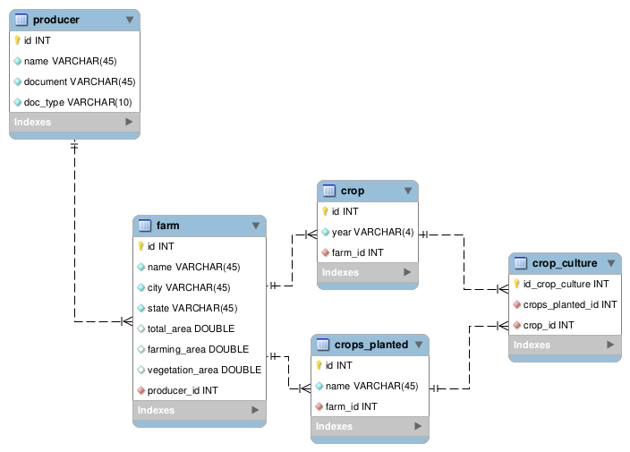

# Sistema de Gerenciamento de Produtores Rurais

Este é um sistema de gerenciamento de produtores rurais que permite o cadastro, edição, exclusão e visualização de produtores, fazendas, safras e culturas plantadas. A aplicação também fornece um dashboard para visualização de métricas importantes, como a distribuição de fazendas por estado, culturas plantadas, uso do solo e muito mais.

---

## Funcionalidades

- **Gerenciamento de Produtores**: Cadastro, atualização, listagem e exclusão de produtores rurais.
- **Gerenciamento de Fazendas**: Controle de propriedades rurais com validações de área agricultável e vegetação.
- **Gerenciamento de Safras**: Registro de safras associadas às fazendas.
- **Culturas Plantadas**: Registro e associação de culturas às safras.
- **Dashboard**: Gráficos e métricas importantes:
  - Total de fazendas cadastradas.
  - Total de hectares registrados.
  - Gráficos de pizza por estado, cultura plantada e uso do solo.

---

## Tecnologias Utilizadas

- **Backend**: [NestJS](https://nestjs.com/) - Framework para Node.js.
- **Banco de Dados**: PostgreSQL.
- **ORM**: TypeORM.
- **Documentação**: Swagger.
- **Validações**: Class-validator e custom validators.
- **Testes**: Jest.
- **Observabilidade**: OpenTelemetry.

---

## Estrutura do Projeto

A estrutura do projeto está organizada de forma modular para garantir escalabilidade e organização:

```plaintext
src/
├── config/                  # Configurações globais, como Swagger
├── entity/                  # Entidades globais
├── modules/                 # Módulos da aplicação
│   ├── crop/                # Safras
│   ├── crops_planted/       # Culturas plantadas
│   ├── dashboard/           # Dashboard
│   ├── farm/                # Fazendas
│   └── producer/            # Produtores
└── validators/              # Validações customizadas
```

---

## Pré-requisitos

Certifique-se de ter as seguintes ferramentas instaladas em sua máquina:

- Docker e Docker Compose
- Node.js (versão mínima: 16.x)
- NPM ou Yarn

---

## Como Executar o Projeto Localmente

### Passo 1: Clonar o Repositório

```bash
git clone https://github.com/seu-usuario/seu-repositorio.git
cd seu-repositorio
```

### Passo 2: Configurar Variáveis de Ambiente

Crie um arquivo `.env` na raiz do projeto com as seguintes variáveis:

```plaintext
DATABASE_HOST=database
DATABASE_PORT=5432
DATABASE_USER=postgres
DATABASE_PASSWORD=postgres
DATABASE_NAME=agriculture
OTEL_SERVICE_NAME=brain
OTEL_EXPORTER_OTLP_ENDPOINT=http://otel-collector:4317
OTEL_TRACES_EXPORTER=otlp
OTEL_LOGS_EXPORTER=otlp
```

### Passo 3: Subir o Ambiente com Docker

Utilize o Docker Compose para subir o ambiente local:

```bash
docker-compose up --build
```

A aplicação estará disponível em: `http://localhost:3001`.

### Passo 4: Acessar a Documentação da API

A documentação da API estará disponível em: `http://localhost:3001/api-docs`.

## Testes

Para rodar os testes automatizados, execute:

```bash
npm run test
```

## Diagrama



## Licença

Este projeto está licenciado sob a [MIT License](https://opensource.org/licenses/MIT).
